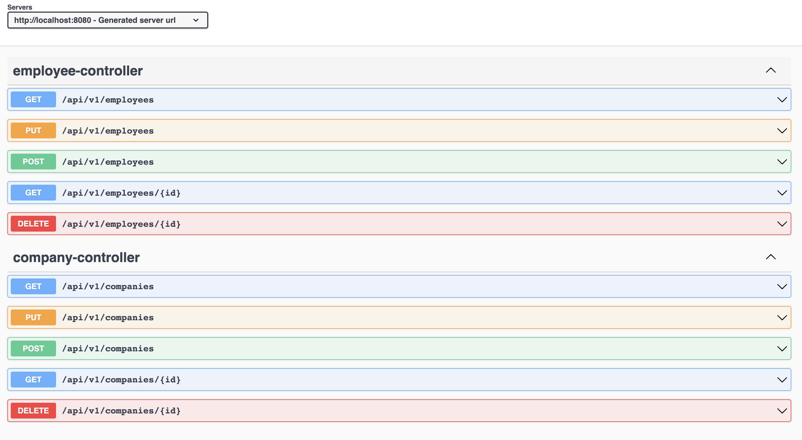
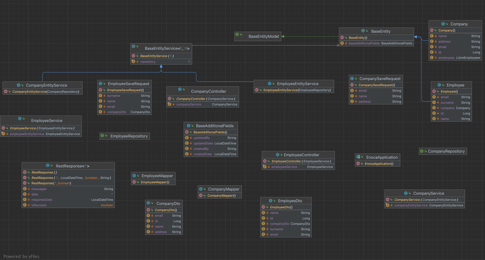

## Kullanılan Teknolojiler

- **Spring Boot:**
- **JPA (Java Persistence API):** 
- **Doğrulama (Validation):** 
- **Web:** Spring Boot Web,
- **Spring Boot DevTools:** 
- **PostgreSQL:** 
- **Project Lombok:** 
- **OpenAPI (Swagger):** OpenAPI belgelerini oluşturmak ve API'yi görselleştirmek için kullanılır. API dokümantasyonunu kolaylaştırır.

## Kullanılan Ortak Sınıflar

1. **BaseAdditionalFields**:
   - Bu sınıf, diğer tüm Entity sınıflarında kullanılması gereken ortak alanları içerir.
   - Veritabanı tablolarındaki ortak alanları yönetmek için kullanılır.

2. **BaseEntity**:
   - BaseEntity sınıfı, tüm Entity sınıflarının temelini oluşturur.
   - Serializable ve Cloneable arabirimlerini uygular ve BaseEntityModel arabirimini içerir.

3. **BaseEntityService**:
   - BaseEntityService, BaseEntity sınıfıyla çalışan bir servis sınıfıdır.
   - Generic tür parametreleri kullanarak herhangi bir BaseEntity türü ve JpaRepository tipi ile çalışabilir.
  

## OpenAPI definition

## Project Diagram

4. **RestResponse**:
   - RestResponse, RESTful API yanıtlarını temsil etmek için kullanılır.
   - Generic tür parametresi ile birlikte kullanılır ve farklı veri türlerini temsil etmek için esneklik sunar.

