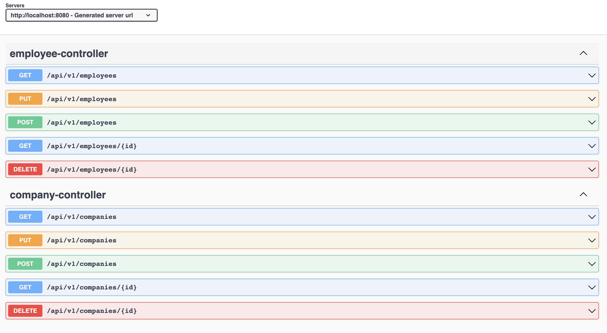
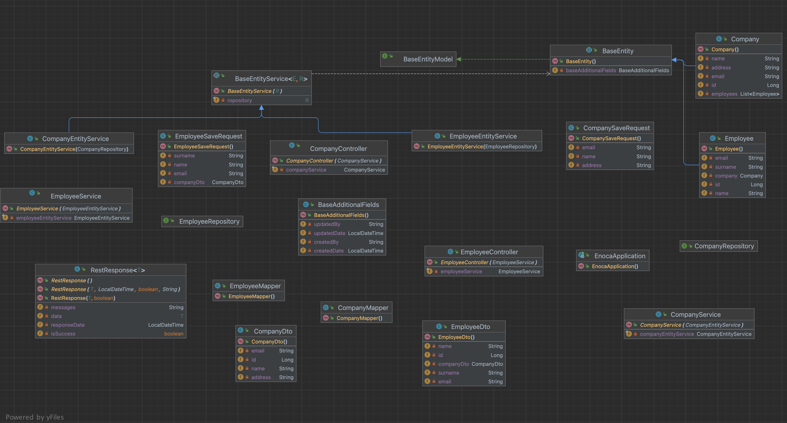
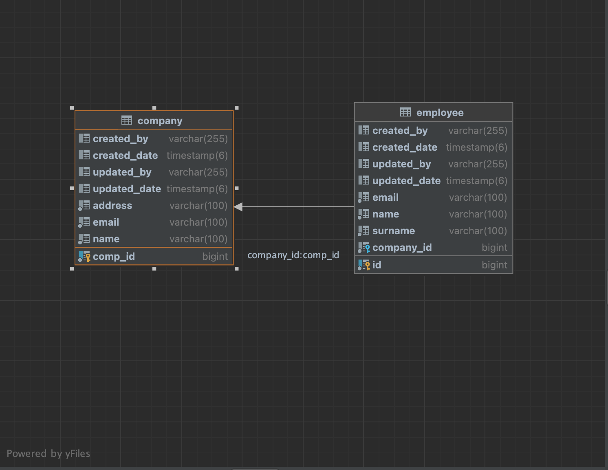

# Spring Boot Company and Employee Management

Bu Spring Boot projesi, Company ve Employee sınıfları arasında One-to-Many ve Many-to-One ilişkisi oluşturur ve verileri database e kayıteder.

## Özellikler

- **Company Yönetimi:** Şirket ekleme, seçme, güncelleme ve silme işlemleri.
- **Employee Yönetimi:** Çalışan ekleme, var olan şirket ekleme, seçme, güncelleme ve silme işlemleri.
- **Şirket-Çalışan İlişkisi:** Bir şirketin birden fazla çalışanı olabilir.

## Teknolojiler
- **Spring Boot:**
- **JPA (Java Persistence API):** 
- **Doğrulama (Validation):** 
- **Web:** Spring Boot Web,
- **Spring Boot DevTools:** 
- **PostgreSQL:** 
- **Project Lombok:** 
- **OpenAPI (Swagger):** OpenAPI belgelerini oluşturmak ve API'yi görselleştirmek için kullanılır. API dokümantasyonunu kolaylaştırır.
- **Maven:** Bağımlılık yönetimi ve proje yapılandırması için kullanılır.

## Proje Yapısı

- **Company Entity:** Şirket bilgilerini temsil eder ve Employee ile One-to-Many ilişkisine sahiptir.
- **Employee Entity:** Çalışan bilgilerini temsil eder ve Company ile Many-to-One ilişkisine sahiptir.
- **CompanyService:** Şirket iş mantığı ve veritabanı işlemleri için servis sınıfı.
- **EmployeeService:** Çalışan iş mantığı ve veritabanı işlemleri için servis sınıfı.
- **CompanyController:** Şirketle ilgili HTTP isteklerini işler.
- **EmployeeController:** Çalışanla ilgili HTTP isteklerini işler.

 ## Kullanılan Ortak Sınıflar

1. **BaseAdditionalFields**:
   - Bu sınıf, diğer tüm Entity sınıflarında kullanılması gereken ortak alanları içerir.
   - Veritabanı tablolarındaki ortak alanları yönetmek için kullanılır.

2. **BaseEntity**:
   - BaseEntity sınıfı, tüm Entity sınıflarının temelini oluşturur.
   - Serializable ve Cloneable arabirimlerini uygular ve BaseEntityModel arabirimini içerir.

3. **BaseEntityService**:
   - BaseEntityService, BaseEntity sınıfıyla çalışan bir servis sınıfıdır.
   - Generic tür parametreleri kullanarak herhangi bir BaseEntity türü ve JpaRepository tipi ile çalışabilir.
  
4. **RestResponse**:
   - RestResponse, RESTful API yanıtlarını temsil etmek için kullanılır.
   - Generic tür parametresi ile birlikte kullanılır ve farklı veri türlerini temsil etmek için esneklik sunar.

## Swagger Nasıl Kullanılır

1. Projeyi bilgisayarınıza klonlayın.
2. Uygulamayı başlatmak için `mvn spring-boot:run` komutunu kullanın.
3. Tarayıcınızda http://localhost:8080/swagger-ui/index.html#/ adresine gidin.

## Swagger EndPoint Dökümantasyonu

## Proje Diagram

## Database Diagram

   

